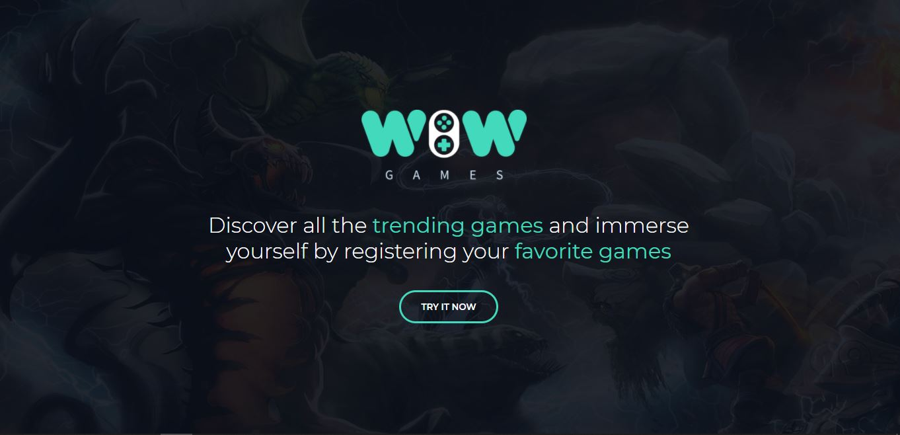
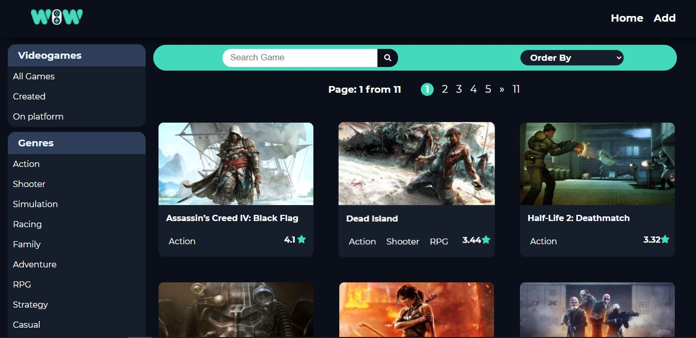
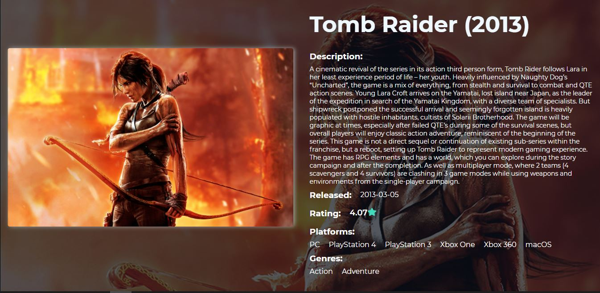
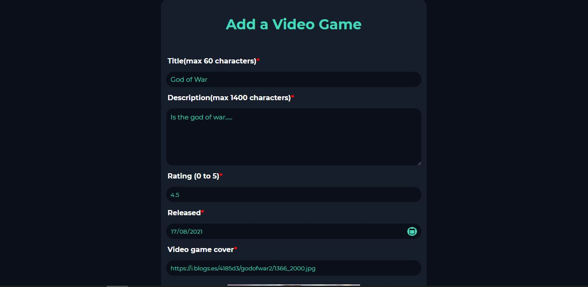
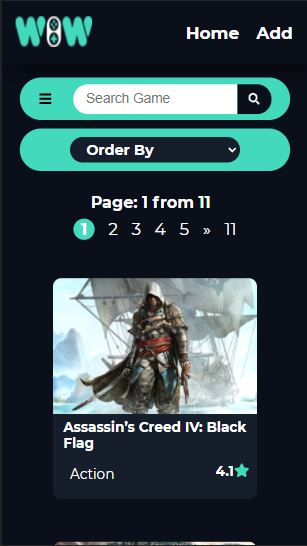
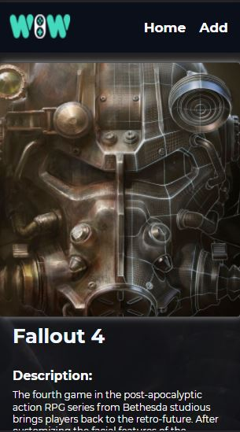
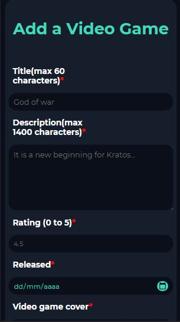

<h1 align="center">Hi 👋, I'm Manuel Villarroel</h1>
<h3 align="center">I am who loves video games and technology. I am currently focused on full stack web development.I am studying a career in Informatics Engineering
and I would love to learn new technologies to exploit them. This year I obtained a full web developer certification, I want to share with you my skills and I hope you enjoy this visit to my profile. Welcome!!!</h3>

```javascript
const aboutMe = {
   pronouns: "he" | "him",
   code: [Javascript, Typescript, HTML, CSS, Python],
   technologies: {
      frontEnd: {
         js: ["React", "Redux"],
         css: ["Bootstrap", "Material UI"]
      },
      backEnd: {
         js: ["Node", "Express"]
      },
      databases: ["PostgreSQL"],
   },
   currentOccupation: ["Studying computer science engineering"],
};
```
- 🌱 I am currently studying a career (Eng. In Informatics), and learning C and Python
- 💬 Ask me about **JavaScript, React, Redux, HTML, CSS, Node JS, Express, PostgreSQL, TypeScript, Sequelize**
- 📫 How to reach me **manuel17973433@gmail.com**
- ⚡ Fun fact ** After many hours of writing code, I like to play video games with my friends or just have fun with my loved ones **
<h3 align="left">Connect with me:</h3>
<p align="left">
<a href="https://www.linkedin.com/in/manuel-benjamin-villarroel-bedregal/" target="_blank"></a>
</p>
<h3 align="left">Languages and Tools:</h3>
<p align="left">  <a href="https://developer.mozilla.org/en-US/docs/Web/JavaScript" target="_blank">  </a> 
<a href="https://www.w3.org/html/" target="_blank">  </a>
<a href="https://www.w3schools.com/css/" target="_blank">  </a> 
<a href="https://getbootstrap.com" target="_blank">  </a> 
<a href="https://reactjs.org/" target="_blank">  </a> 
<!--
<a href="https://reactnative.dev/" target="_blank">  </a> 
-->
<a href="https://redux.js.org" target="_blank">  </a> <a href="https://sass-lang.com" target="_blank">  </a>
<a href="https://babeljs.io/" target="_blank">  </a>
<a href="https://nodejs.org" target="_blank">  </a>
<a href="https://expressjs.com" target="_blank">  </a> 
<a href="https://git-scm.com/" target="_blank">  </a> 
<a href="https://www.postgresql.org" target="_blank">  </a> 
<a href="https://postman.com" target="_blank">  </a> 
<a href="https://mochajs.org" target="_blank">  </a>
<!--
<a href="https://www.typescriptlang.org/" target="_blank">  </a>
-->
<p align="left">
  <a href="https://github.com/Hasuro1797">
  <a href="https://github.com/Hasuro1797">
  <a href="https://github.com/Hasuro1797">
</p>
     
## My repos
    
<p align="left">
  
   <a href="https://github.com/Hasuro1797/AppVideogames">
   <a href="https://github.com/RodrigoToledo5/ConsultanceSpace">
</p>  


<br><br/>

<h4 align="center">Visitor's :eyes:</h4>

<p align="center"></p>

# Individual Project - Henry Videogames
     
<p align="center">
  <table>
  <tr>
    <td>Landing Page</td>
    <td>Home Page</td>
  </tr>
  <tr>
    <td></td>
    <td></td>
    
  </tr>
  <tr>
    <td>Detail Page</td>
     <td>Form Page</td>
  </tr>
  <tr>
    <td></td>
    <td></td>
  </tr>
  <tr>
    <td>Landing Page Movil</td>
     <td>Home Movil</td>
  </tr>
  <tr>
     <td><p align="center"></p></td>
     <td><p align="center"></p></td>
  </tr>
  <tr>
    <td>Detail Movil</td>
     <td>Form Movil</td>
  </tr>
  <tr>
     <td><p align="center"></p></td>
     <td><p align="center"></p></td>
  </tr>
  </table>
 </p>
<!--
